# ManjaroKdeInstallRoutine

Step by step description on how to setup Manjaro KDE.

---

IMPORTANT: THERE IS NO GUARANTEE THAT NOTHING GOES WRONG SO BE CAREFUL AND IF YOU ARE UNSURE RESEARCH WHAT A CERTAIN STEP MEANS!

---

## 1. Create a from the motherboard bootable USB stick

1. Download the `.iso` file from the [Official Manjaro Website](https://manjaro.org/downloads/official/kde/)

   For a minimal, non bloated installation and a fast download the *Minimal* version is chosen

2. *Burn*/*Flash* the `.iso` file to a USB stick using for example [(Balena) Etcher](https://www.balena.io/etcher/) which is available for Windows, Linux and macOS

   **Be careful since this formats your USB stick and that you select the correct drive!**

## 2. Now reboot your PC and start the Manjaro on the USB stick

1. You need to check online or look at the initial boot image of your PC to see how to enter the motherboard BIOS so you can in there select a custom boot medium

   For my ASUS motherboard the initial boot image says press `F11` to enter the boot menu where I then get a list of all devices that the motherboard can boot

2. Boot the Manjaro USB stick by selecting its entry in the BIOS (for me it is called *UEFI USB STICK*)
3. After you press enter and boot a new screen comes up where you can configure how the Manjaro on the USB stick should boot

   - If you have an NVIDIA GPU and want to check out if certain features like G-Sync or CUDA work before installing Manjaro select *boot with proprietary drivers* since the OpenSource NVIDIA work good enough but don't have these special features implemented (You can switch later to either driver version though)

## 3. Prepare your installation drive

---

Since in the past I got errors when running the default installer on drives that were not empty I recommend to clear the drive since the error actually can result in you needing to restart the whole process:

- The installer ends with this error:

  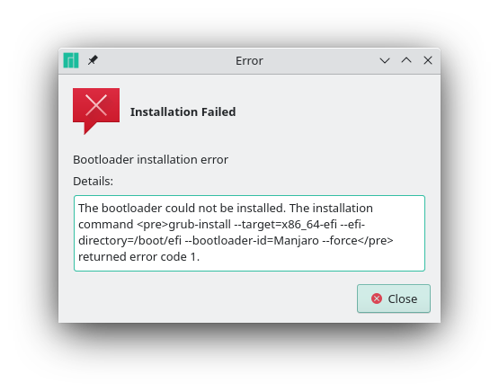

- This error even prevents `gnome-disk-utility` from formatting the drive:

  

---

1. Open the terminal and update the package manager database so you can install other programs:

   *If you have problems with your keyboard layout you might wanna go to step 4. and follow the default installer until the step with the keyboard layout (after you set the right layout just close the installer and come back to this point)*

   ```sh
   sudo pacman -Sy
   ```

2. Install `gnome-disk-utility` which is a program to format and partition drives:

   ```sh
   sudo pacman -S gnome-disk-utility
   ```

3. Run `gnome-disks` or search for *Disks*:

   1. Find the drive on which you want to install Manjaro

      

   2. Select it and clear all partitions

      

      

      It should now look like this:

      

## 4. Follow the steps of the official installer

1. Launch the installer by clicking the button *Launch installer*:

   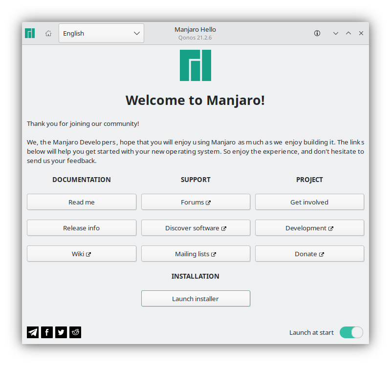

2. Set the language of your installation:

   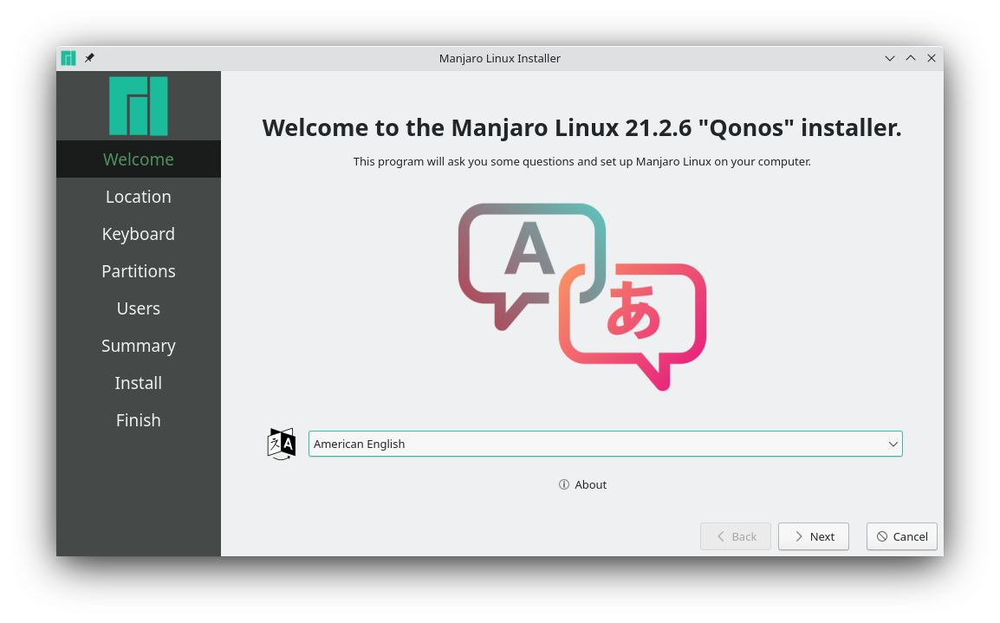

3. Set the time zone of your installation:

   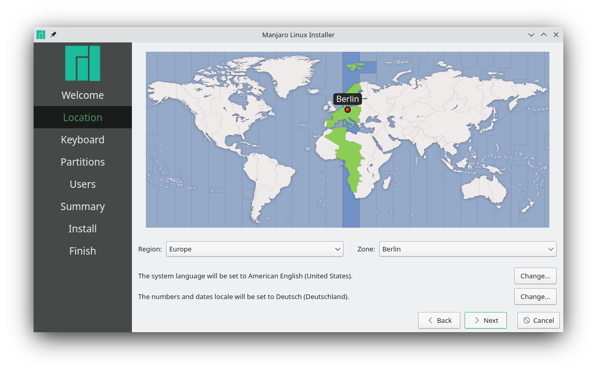

4. Set the keyboard layout of your installation:

   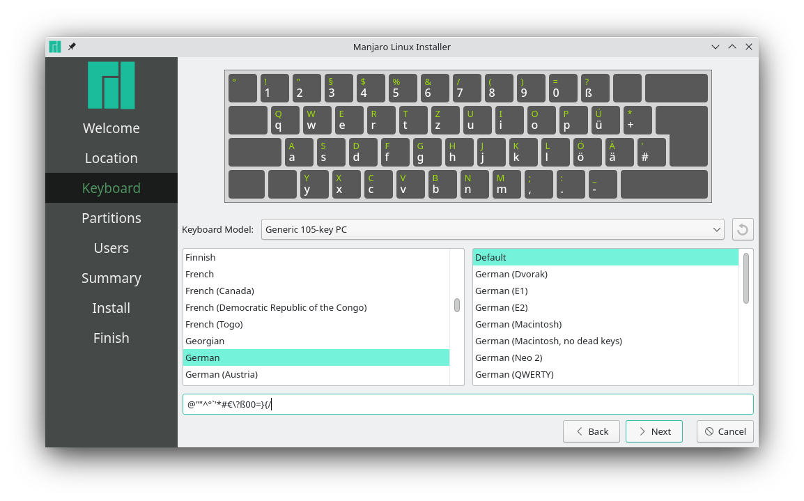

5. Specify the partitioning of your installation:

   **Be careful since this formats your USB stick and that you select the correct drive!**

   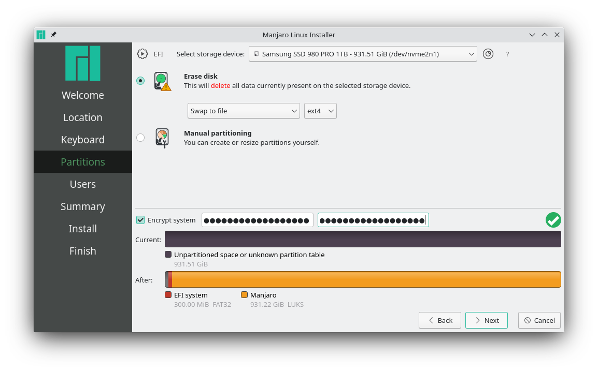

   - `ext4` is the standard/default
   - Swap to file was chosen since at least on my hardware hibernation is not working so there is no need to do a partition for that one since it can just be a file anyways
   - Encryption was chosen for security, it means that your drive needs to be decrypted before every boot and every access from another PC but it also means that your data can not just be read by anyone without the password

   **Make sure that it says EFI in the left corner of the installer if you want to create an UEFI installation medium (some older motherboards don't like UEFI so to change that boot the USB stick via the non UEFI entry in the BIOS)!**

6. Set the user name and passwords of your installation:

   *Make sure by typing your password into a field that shows text that all special characters in your password are correctly recognized and that you didn't make an error when choosing the keyboard layout!*

   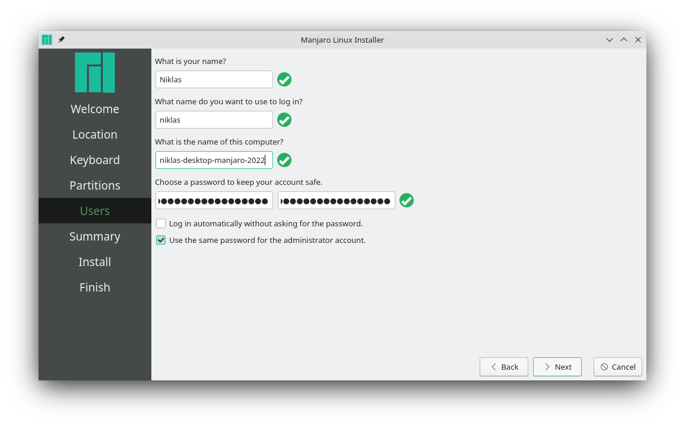

7. In the summary make sure that everything is exactly as you want and that the correct drives will be used:

   

8. Reboot your PC:

   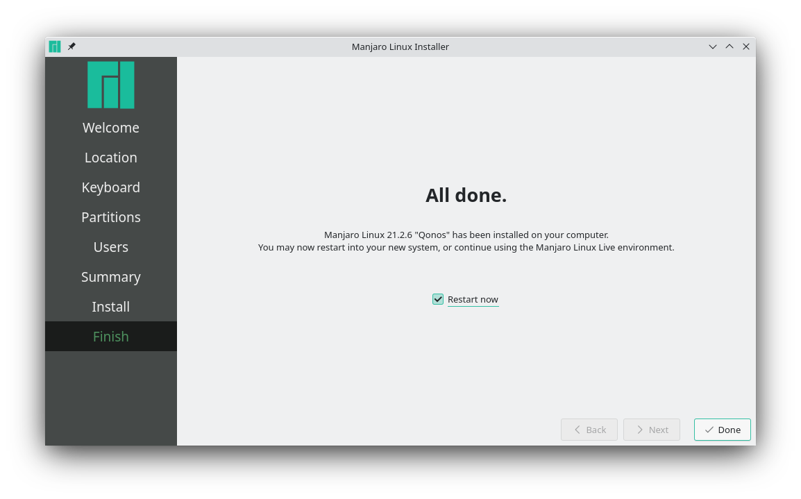

    In case your PC is not booting the new Manjaro drive automatically since the USB stick is still plugged in or you have another drive with a different OS that is in front of it check step 2 on how to enter the BIOS.
    You should be able to edit the boot order of all found drives with bootable operating systems in any BIOS.

## 5. Finalize installation

1. Swap file

   Since the default swap file is somehow not even 1GB here are the commands you need to run to replace it with one of a custom size (this depends on how much you want and how much RAM you have obviously):

   ```sh
   # List the swapfile
   swapon
   # Turn it off
   sudo swapoff /swapfile
   # Remove it
   sudo rm /swapfile
   # Create a new swapfile
   sudo dd if=/dev/zero of=/swapfile bs=1M count=38GB status=progress
   sudo chmod 600 /swapfile
   sudo mkswap /swapfile
   # Enable the new swapfile
   sudo swapon /swapfile
   ```

   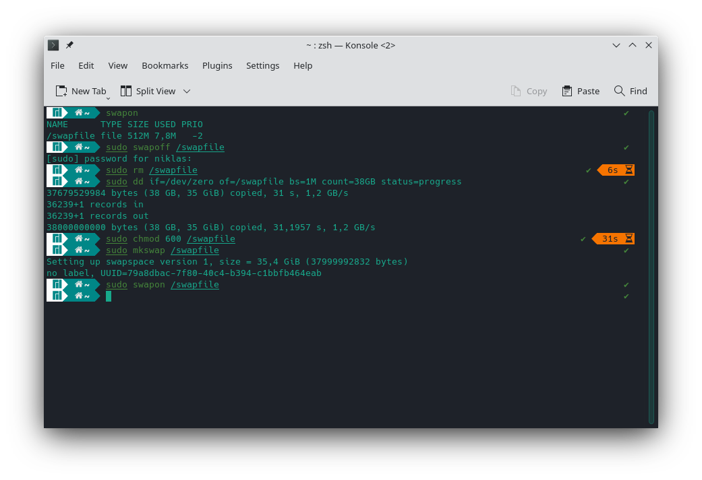

2. Switch branch

   If you want to get faster (but also more unstable) updates you can switch to a different Manjaro branch:

   ```sh
   # Replace testing with the branch you want to switch to
   sudo pacman-mirrors --api --set-branch testing
   ```

   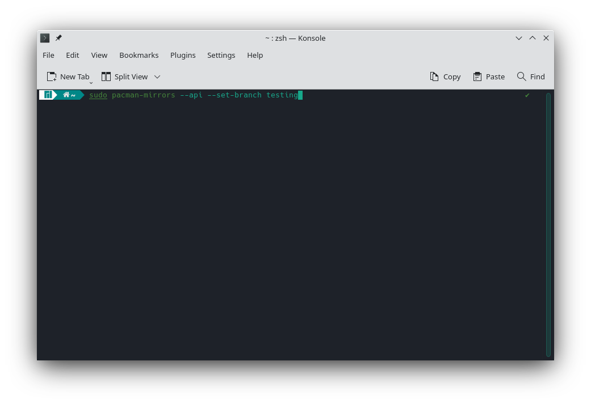

   Then update all packages and find the fastest mirrors:

   ```sh
   sudo pacman-mirrors --fasttrack 5 && sudo pacman -Syyu
   ```

   

3. Update package manager database and update all packages (unnecessary if 2. was executed):

   ```sh
   sudo pacman -Syu
   ```

4. Switch kernel

   If you want to be on the latest stable kernel or simply another kernel you can switch it and then reboot afterwards into it:

   *Open the 'manjaro settings manager'*

   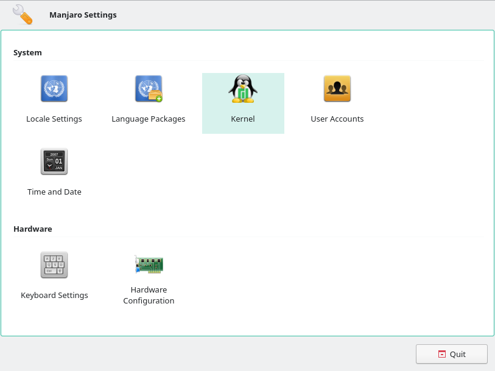

   *Click 'install' to select which kernel to install (the latest installed kernel will be used as a default on a normal start, older kernels are always available as backups in case something breaks with the other kernel)*

   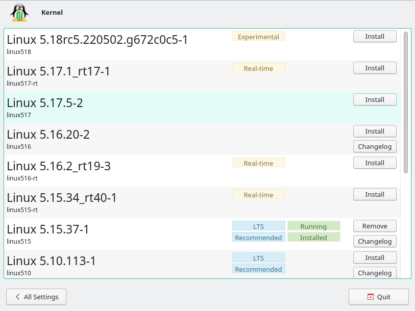

## 6. Enable AUR/3rd-party package support

Since the default repositories don't include all OpenSource programs in the world and especially not proprietary programs AUR support makes access to these kinds of programs/packages much easier:

```sh
sudo pacman -S yay
```

`yay` is able to read the AUR database and thus can be used to install for example `spotify`, `google-chrome` or games like `osu!lazer`:

```sh
# Example command to install a package from the AUR
yay -S spotify
```

Since I had problems installing certain AUR packages and other programs there is a recommended list of programs that you should probably just install so you have less problems down the line when they are missing on certain dependency lists:

```sh
# General build programs
sudo pacman -S make pkgconf patch cmake gcc clang
# General helpful CLI programs
sudo pacman -S vim grep
```

## 7. Configure KDE

---

*Open your system settings for configuring KDE (from 2. onwards)*

---

1. Disable autostart:

   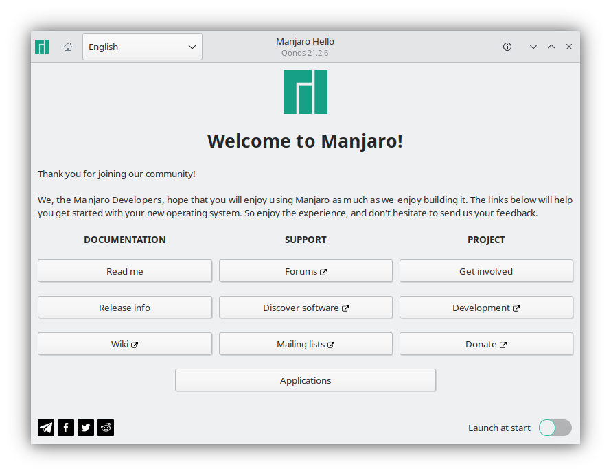

2. Setup your display(s) since the frequency is probably wrong:

   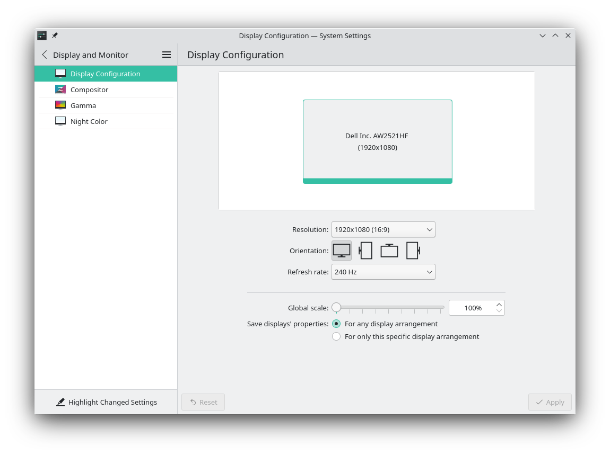

3. Setup your mouse to disable acceleration or other things:

   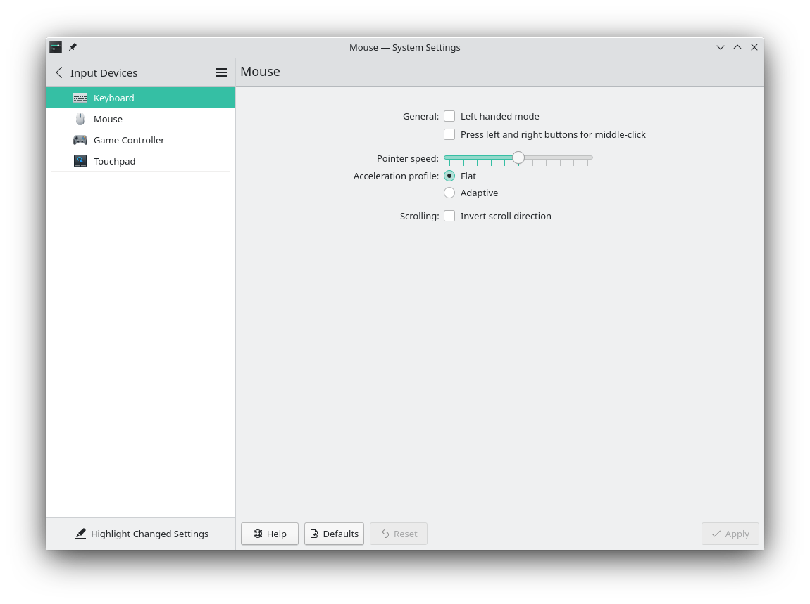

4. Setup your desktop wallpaper:

   *You get to this by doing a right click on an empty space on the Desktop and selecting `configure desktop and wallpaper`*

   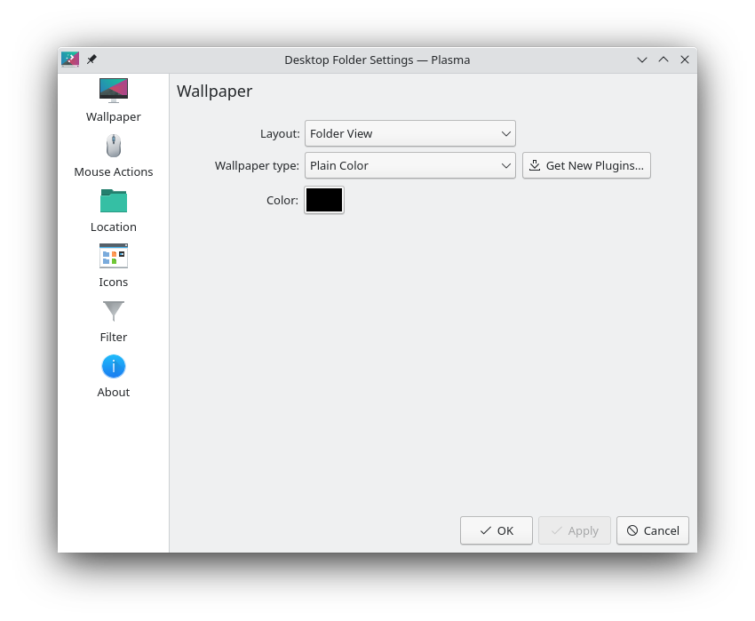

5. Setup your login screen:

   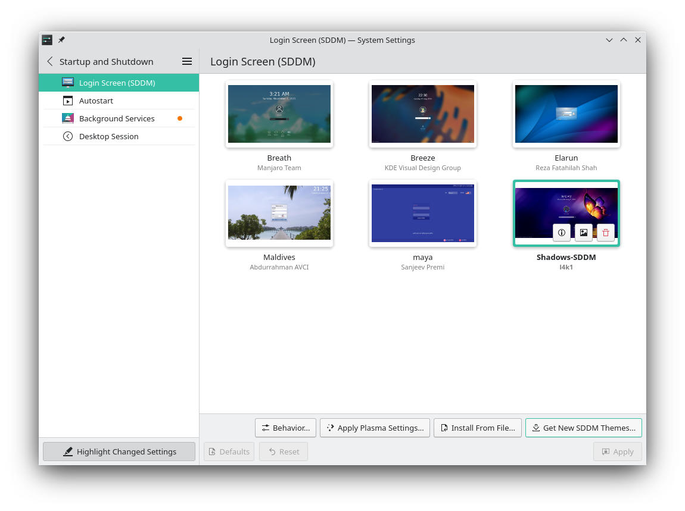

6. Setup your lock screen:

   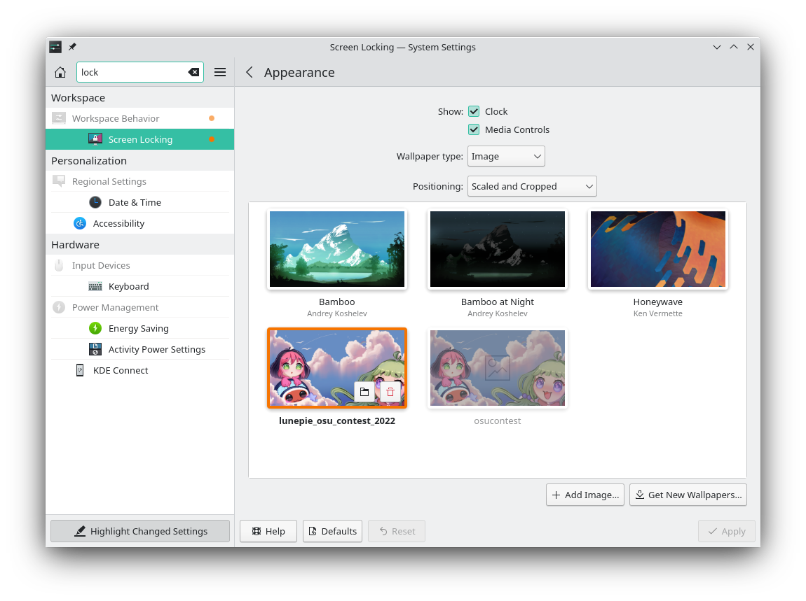

7. Connect (Google) calendar

   It is possible to sync other calendar services like Google calendar with KDE by downloading `korganizer` and additionally installing `kdepim-addons`.

   In `korganizer` you can connect to the calendar service of your choice (and configure how often it should synchronize) and in the calendar widget panel settings you can now activate **PMI Events Plugin** which gives you a new subsection in this window where you can select connected calendars to make them show up in the widget.

8. Connect a smartphone

   It is possible to connect a smartphone and some of its functionality (like storage and notification access) out of the box.

   To do this you need to download the app [KDE Connect](https://kdeconnect.kde.org/) for your smartphone and then pair it with your KDE installation by starting the preinstalled *KDE Connect* program.
   Now you can on your smartphone add notification, storage access and more which in turn makes it able to for example access your phone storage in the default file manager and the notifications next to the other notifications.

   You can even configure it to share the clipboard contents (you copy text on your desktop and can paste it on your phone or do it in the opposite direction).

9. Connect a printer

   It is possible to easily connect printers to KDE and manage them in the system settings after installing the `manjaro-printer` package group.

   ```sh
   sudo pacman -S manjaro-printer
   ```

   To enable the print service you can either make it run only temporarily or even permanently enable the service after the next reboot.

   ```sh
   # Optionally enable permanent the print service
   sudo systemctl enable cups.service
   # Start the print service
   # (works only temporarily without the previous command)
   sudo systemctl start cups.service
   ```

   After this step you can open the system settings and go to the *Printers* section.
   For example your network printer should automatically be listed after clicking *Add Printer* and drivers are also either selected automatically or you need to select one manually out of a list of available drivers (the printer name should match the series and driverless often has less options than other options).

   After installing the driver other programs should be able to find the connected printers.

10. Configure Virtual Desktops

   In the system settings under the section *Virtual Desktops* you can configure the layout (rows/columns), number and switch animation of desktops.

   You can also set custom keyboard shortcuts for easy switching between the desktops.
   For that you search in the system settings for *Shortcuts* and then go to the section *KWin*.

   When you for example set up 1 row with 3 columns and you want some keybindings to go easily to the next/previous desktop you can set:

   - *Switch to next Desktop*: `Ctrl` + `Alt` + `Left Arrow`
   - *Switch to previous Desktop*: `Ctrl` + `Alt` + `Right Arrow`

## 8. Install programs

### Printing

```sh
# Scan pages to images/PDF files
sudo pacman -S gscan2pdf
```

### General runtimes

```sh
# JAVA
sudo pacman -S jre-openjdk-headless jre-openjdk jdk-openjdk
# Python
sudo pacman -S python
# NodeJs
sudo pacman -S nodejs
```

### Tune CPU

```sh
# You can configure the CPU to not run in a powersave
# mode but in a performance mode
yay -S corectrl
```

This will result in a much higher power usage when doing non intensive tasks so only do it if you actually see a difference in performance or only enable it while you need high performance.

### Microphone noise cancelling

```sh
# You can create a new virtual microphone based on an
# existing microphone but with noise cancelling
yay -S noisetorch
```

### Gaming

```sh
# Steam (Don't forget to go into the settings and
#        enable 'Steam Play' for all titles)
# > You can copy downloaded Steam games from another
#   drive onto your new drive without any download
sudo pacman -S steam
# Lutris
# > Install wine for the latest wine(-system) version
sudo pacman -S lutris
# Gaming stats
sudo pacman -S mangohud gamemode
yay -S goverlay
```

### Cloud Storage

```sh
# OneDrive
# > run 'onedrive --synchronize --download-only' for
#   an initial download of all data to '~/OneDrive'
# > run 'onedrive --monitor' to sync changes in both
#   directions
yay -S onedrive-abraunegg
```

## Wayland

To enable Wayland check [this article](https://community.kde.org/Plasma/Wayland/Nvidia):

- On NVIDIA GPUs the kernel parameter `nvidia_drm.modeset=1` needs to be added when the Wayland session does not work out of the box (and `sudo cat /sys/module/nvidia_drm/parameters/modeset` returns `N`)
  - To do this edit the grub file (`/etc/default/grub`) and update the line `GRUB_CMDLINE_LINUX="nvidia_drm.modeset=1"`, then run `sudo update-grub`
- On the login screen select `Wayland session`

Current Problems:

- GitHub Desktop does not work any more

## More

- To get a "boot" screen where you can switch kernels or do more advanced stuff before actually launching Manjaro/*the Linux kernel* you need to hold the `SHIFT` key after the BIOS prompt
  - This can be helpful if for example an external hard drive is not detected any more but was detected on a previous Linux kernel
